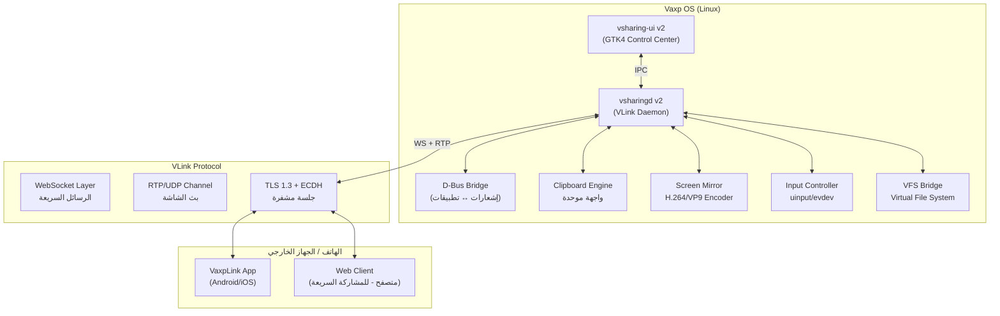
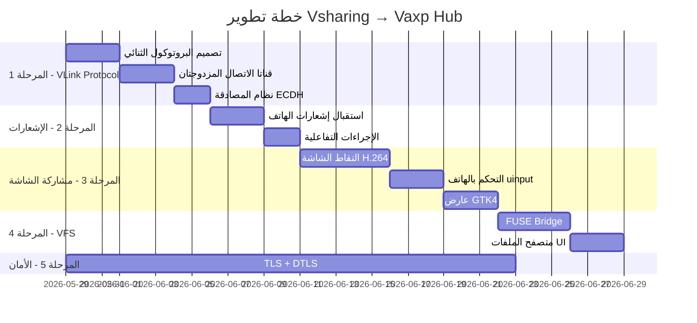

# 🌐 Vsharing → Vaxp Ecosystem Hub
## خطة التحويل الشاملة: من تطبيق مشاركة إلى العصب الرئيسي للنظام

---

> [!IMPORTANT]
> الهدف النهائي: تحويل `vsharingd` من خادم HTTP بسيط إلى **بروتوكول VLink** — طبقة اتصال موحدة بين Vaxp OS وأي جهاز خارجي (Android/iOS/Linux)، بسرعة تتيح مشاركة الشاشة الحية والتحكم الكامل.

---

## 🔍 التحليل الحالي للمشروع

| المكوّن | الحالة الراهنة | القيود |
|---|---|---|
| `vsharingd` | خادم HTTP/WebSocket على منفذ 5000 | بروتوكول نصي بطيء، لا تشفير |
| `vsharing-ui` | GTK4 + رادار Avahi بسيط | لا تكامل مع باقي التطبيقات |
| نقل الملفات | HTTP POST بسيط عبر المتصفح | لا ضغط، لا استئناف |
| الحافظة | Polling كل 500ms عبر `/tmp` | تأخر، يستهلك موارد |
| الإشعارات | D-Bus أحادي الاتجاه فقط | لا استقبال من الهاتف |
| الاكتشاف | mDNS/Avahi | لا دعم للاتصال عبر الإنترنت |

---

## 🏗️ المعمارية الجديدة: VLink Protocol Stack



---

## 📋 خريطة المراحل (Roadmap)

### ✅ المرحلة 0 — الأساس الحالي (مكتملة)
- نقل ملفات عبر HTTP
- مزامنة الحافظة النصية
- اكتشاف الأجهزة mDNS
- واجهة ويب للهاتف

---

### 🚀 المرحلة 1 — بروتوكول VLink الأساسي
**المدة المقدرة:** أسبوع واحد

#### 1.1 تصميم بروتوكول الرسائل الثنائي (Binary Message Protocol)

استبدال البروتوكول النصي الحالي (`clip:text`) بإطار ثنائي سريع:

```c
// vlink_protocol.h
#pragma pack(push, 1)
typedef struct {
    uint8_t  magic[4];    // "VLNK"
    uint8_t  version;     // 0x02
    uint8_t  type;        // VLinkMessageType
    uint16_t flags;       // VLinkFlags
    uint32_t payload_len; // حجم البيانات
    uint32_t seq;         // رقم التسلسل (للتأكيد)
    uint32_t checksum;    // CRC32
    uint8_t  payload[];   // البيانات الفعلية
} VLinkFrame;
#pragma pack(pop)

typedef enum {
    VLINK_PING          = 0x01,
    VLINK_PONG          = 0x02,
    VLINK_CLIPBOARD     = 0x10,
    VLINK_NOTIFICATION  = 0x11,
    VLINK_FILE_START    = 0x20,
    VLINK_FILE_CHUNK    = 0x21,
    VLINK_FILE_END      = 0x22,
    VLINK_SCREEN_FRAME  = 0x30,
    VLINK_INPUT_EVENT   = 0x31,
    VLINK_CONTROL       = 0x40,
    VLINK_AUTH          = 0x50,
    VLINK_AUTH_RESP     = 0x51,
} VLinkMessageType;
```

#### 1.2 قناتا الاتصال المزدوجتان

| القناة | البروتوكول | المنفذ | الاستخدام |
|---|---|---|---|
| **Control Channel** | WebSocket/TLS | 5000 | الأوامر، الإشعارات، الحافظة |
| **Stream Channel** | UDP/RTP | 5001 | بث الشاشة، الصوت |

#### 1.3 نظام المصادقة بالجلسة

```c
// مصادقة ECDH + HKDF بدون كلمة مرور
// الجهاز الأول: QR يحمل المفتاح العام + fingerprint
// الجلسات اللاحقة: token مخزن مشفر في ~/.config/vsharing/
typedef struct {
    uint8_t  public_key[32];     // X25519
    uint8_t  device_id[16];      // UUID
    char     device_name[64];
    uint64_t timestamp;
} VLinkAuthRequest;
```

---

### 🔔 المرحلة 2 — مزامنة الإشعارات الكاملة
**المدة المقدرة:** أسبوع واحد

#### 2.1 استقبال إشعارات الهاتف على الحاسوب

```c
// src/daemon/notification_bridge.c
// مستمع D-Bus يستقبل الإشعارات من الهاتف ويبثها للنظام
typedef struct {
    char     app_name[64];
    char     title[128];
    char     body[512];
    char     icon_data[4096];   // base64 PNG للأيقونة
    uint8_t  category;          // message/call/alarm/media
    uint64_t timestamp;
    char     actions[8][64];    // أزرار الإجراءات (رد، إلغاء...)
    char     notification_key[64]; // معرّف فريد لإلغاء التكرار
} VLinkNotification;
```

#### 2.2 الإجراءات التفاعلية على الإشعار

- **رد على رسالة واتساب** من إشعار الحاسوب مباشرة
- **قبول/رفض مكالمة** من إشعار الحاسوب
- **إلغاء إشعار** ينعكس على الهاتف تلقائياً

```c
// D-Bus Action Invocation
static void on_notification_action(const char *notif_key, const char *action_id) {
    // إرسال الإجراء للهاتف عبر VLink Control Channel
    VLinkFrame *frame = vlink_build_frame(VLINK_CONTROL, ...);
    vlink_send(daemon_ctx->control_conn, frame);
}
```

#### 2.3 مزامنة الإشعارات ثنائية الاتجاه

```
الهاتف → [إشعار واتساب] → VLink → D-Bus → إشعار نظام Vaxp
الحاسوب → [إشعار Telegram] → VLink → هاتف → إشعار Android
```

---

### 🖥️ المرحلة 3 — مشاركة الشاشة والتحكم عن بُعد
**المدة المقدرة:** أسبوعان — أصعب وأهم مرحلة**

> [!WARNING]
> هذه المرحلة تتطلب تشفير الشاشة بـ H.264/VP9 وبث UDP لضمان التأخير < 50ms

#### 3.1 التقاط الشاشة عالي الأداء

```c
// src/daemon/screen_mirror.c

// الطريقة الأمثل لـ Wayland: wlr-screencopy-unstable-v1
// الطريقة البديلة لـ X11: XShmGetImage + SHM

typedef struct {
    int      width, height;
    int      fps;           // 15-60 fps حسب العرض الترددي
    int      bitrate;       // 1-8 Mbps
    gboolean use_hw_accel;  // VA-API / NVENC
    
    // ترميز الفيديو
    AVCodecContext *encoder; // FFmpeg libavcodec
    AVFrame        *frame;
    
    // إرسال RTP
    int            udp_sock;
    struct sockaddr_in client_addr;
} ScreenMirrorCtx;

// دورة التقاط والترميز (في thread منفصل)
static void* screen_capture_thread(void *arg) {
    while (ctx->running) {
        capture_frame(ctx);           // التقاط الشاشة
        encode_frame_h264(ctx);       // ترميز H.264
        send_rtp_packets(ctx);        // إرسال UDP/RTP
        frame_rate_limiter(ctx);      // تحديد معدل الإطارات
    }
}
```

#### 3.2 التحكم بالهاتف من الحاسوب (uinput)

```c
// src/daemon/input_controller.c
// تحويل أحداث اللمس من الهاتف إلى أحداث uinput في الحاسوب

#include <linux/uinput.h>

typedef struct {
    int uinput_fd;
    // تطبيع الإحداثيات من دقة شاشة الهاتف إلى دقة الحاسوب
    double scale_x, scale_y;
} InputControllerCtx;

// استقبال حدث لمس من VLink وحقنه في uinput
static void inject_touch_event(InputControllerCtx *ctx, VLinkInputEvent *ev) {
    struct input_event events[3];
    // ABS_X, ABS_Y, BTN_TOUCH, SYN_REPORT
    write(ctx->uinput_fd, events, sizeof(events));
}
```

#### 3.3 مكوّن GTK4 لعرض الشاشة المشاركة

```c
// src/ui/screen_viewer.c
// GtkGLArea لعرض إطارات H.264 المفكوكة بكفاءة عبر OpenGL
// أو GtkDrawingArea + Cairo للتبسيط

typedef struct {
    GtkWidget   *gl_area;
    AVCodecContext *decoder;
    // queue للإطارات المستلمة
    GAsyncQueue *frame_queue;
    // thread لاستقبال UDP
    GThread     *recv_thread;
} ScreenViewerWidget;
```

---

### 📁 المرحلة 4 — نظام الملفات الافتراضي (VFS Bridge)
**المدة المقدرة:** أسبوع واحد

#### 4.1 تصفح ملفات الهاتف مباشرة من AetherFiles

```c
// src/daemon/vfs_bridge.c
// FUSE mount: ~/.vsharing/devices/<device_name>/
// يعرض ملفات الهاتف كمجلد محلي في Vaxp

#include <fuse3/fuse.h>

static int vfs_readdir(const char *path, void *buf, ...) {
    // إرسال طلب VLINK_FS_LIST للهاتف
    // استقبال قائمة الملفات
    // تعبئة buf بالنتائج
}

static int vfs_read(const char *path, char *buf, ...) {
    // إرسال طلب VLINK_FS_READ للهاتف
    // استقبال بيانات الملف
}
```

#### 4.2 واجهة الملفات في vsharing-ui

- شريط جانبي يعرض أجهزة متصلة
- تصفح مجلدات الهاتف مثل مستكشف الملفات
- سحب وإفلات مباشر بين الحاسوب والهاتف
- معاينة الصور/الفيديو مباشرة

---

### 🔒 المرحلة 5 — الأمان والتشفير (Security Layer)
**المدة المقدرة:** موازية مع المراحل السابقة**

#### 5.1 بنية التشفير

```
قناة التحكم (WebSocket):
TLS 1.3 (mbedTLS/OpenSSL) + ECDH X25519 + AES-256-GCM

قناة البث (UDP/RTP):
DTLS 1.3 + SRTP (مثل WebRTC تماماً)
```

#### 5.2 إدارة الأجهزة الموثوقة

```c
// ~/.config/vsharing/trusted_devices.json
{
  "devices": [
    {
      "id": "uuid-...",
      "name": "هاتف عمر",
      "public_key": "base64...",
      "first_seen": "2026-05-28",
      "last_seen": "2026-05-28",
      "permissions": ["clipboard", "notifications", "files", "screen"]
    }
  ]
}
```

---

## 🏛️ الهيكل الجديد للمشروع

```
Vsharing/
├── meson.build
├── src/
│   ├── daemon/
│   │   ├── main.c                  ← نقطة البداية
│   │   ├── daemon_context.h        ← السياق العام المشترك
│   │   ├── vlink_protocol.{c,h}    ← 🆕 البروتوكول الثنائي
│   │   ├── vlink_server.{c,h}      ← 🆕 استبدال server.c
│   │   ├── discovery.{c,h}         ← موجود (تطوير)
│   │   ├── notification_bridge.{c,h} ← 🆕 جسر الإشعارات
│   │   ├── screen_mirror.{c,h}     ← 🆕 بث الشاشة
│   │   ├── input_controller.{c,h}  ← 🆕 حقن أحداث اللمس
│   │   ├── clipboard_engine.{c,h}  ← 🆕 محرك الحافظة المحسّن
│   │   ├── vfs_bridge.{c,h}        ← 🆕 جسر نظام الملفات
│   │   └── auth_manager.{c,h}      ← 🆕 التحقق من الهوية
│   └── ui/
│       ├── main.c
│       ├── window.{c,h}            ← تطوير شامل
│       ├── screen_viewer.{c,h}     ← 🆕 عارض الشاشة
│       ├── device_panel.{c,h}      ← 🆕 لوحة الأجهزة
│       ├── file_browser.{c,h}      ← 🆕 متصفح ملفات الهاتف
│       └── notification_center.{c,h} ← 🆕 مركز الإشعارات
├── data/
│   ├── style.css                   ← تحديث
│   ├── vsharing.desktop
│   └── icons/
└── android/                        ← 🆕 تطبيق Android (Java/Kotlin)
    └── VaxpLink/
```

---

## ⚡ مؤشرات الأداء المستهدفة

| المقياس | الحالي | الهدف |
|---|---|---|
| تأخير الحافظة | ~500ms | **< 20ms** |
| تأخير الشاشة | N/A | **< 50ms** |
| سرعة نقل الملفات | ~5 MB/s | **> 50 MB/s** |
| تأخير الإشعارات | N/A | **< 100ms** |
| استهلاك CPU (بث) | N/A | **< 5%** (HW accel) |
| أمان | لا تشفير | **TLS 1.3 + SRTP** |

---

## 🔌 التكامل مع تطبيقات Vaxp الأخرى

| التطبيق | نوع التكامل |
|---|---|
| **AetherFiles** | تصفح ملفات الهاتف مباشرة عبر FUSE mount |
| **AetherNotif** | استقبال وعرض إشعارات الهاتف في مركز الإشعارات |
| **SonicWave** | مشاركة مقاطع صوتية مباشرة عبر VLink |
| **VCamera** | استخدام كاميرا الهاتف كـ webcam عبر VLink |
| **VConvert** | إرسال ملفات للتحويل وإعادتها للهاتف |
| **AetherTheme** | مزامنة الثيم مع تطبيق الهاتف |

---

## 📅 جدول التنفيذ المقترح



---

## 🎯 الخطوة الأولى الفورية

> [!TIP]
> **ابدأ بـ المرحلة 1** — تصميم `vlink_protocol.h` و`vlink_server.c` كبديل لـ `server.c` الحالي مع الحفاظ على التوافق مع الواجهة الويب الحالية للهاتف. هذا يبني الأساس لجميع الميزات اللاحقة.

**الملفات الجديدة التي سننشئها أولاً:**
1. `src/daemon/vlink_protocol.h` — تعريف البروتوكول
2. `src/daemon/vlink_server.c` — الخادم الجديد
3. `src/daemon/auth_manager.c` — المصادقة
4. `src/daemon/clipboard_engine.c` — محرك حافظة محسّن (بدون polling)
